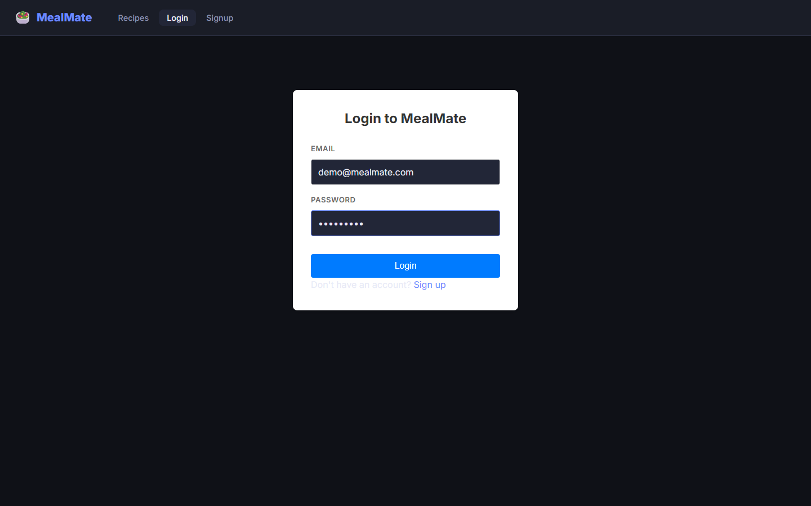
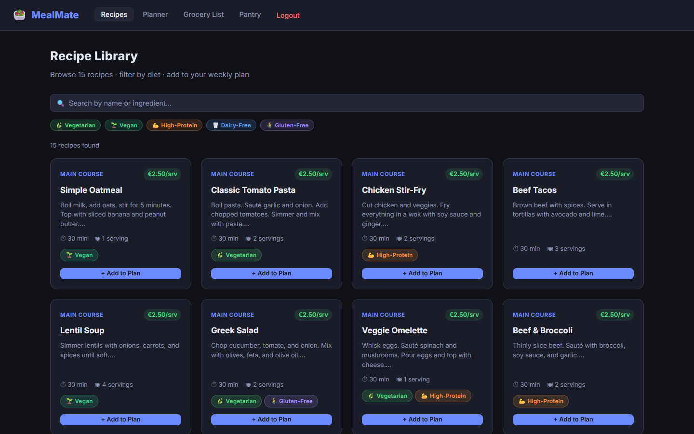
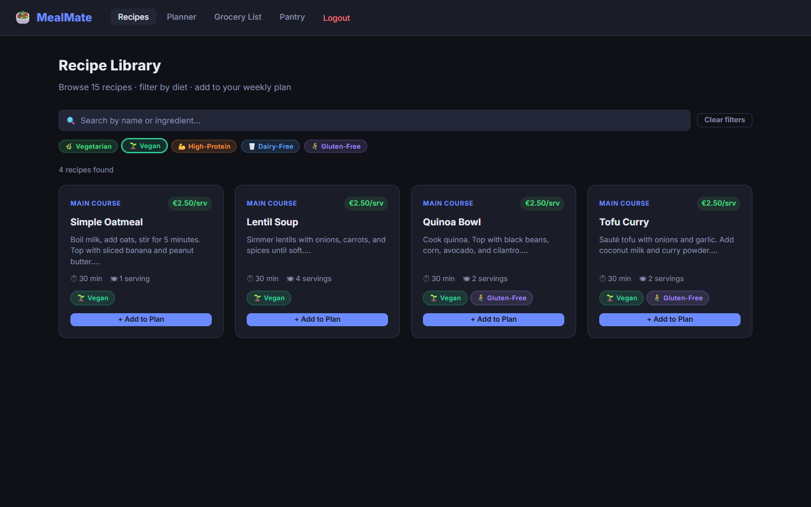
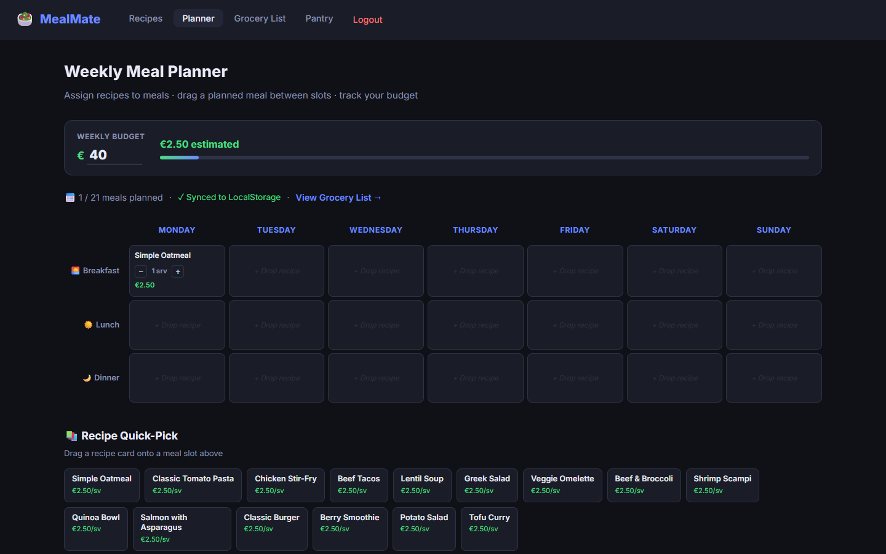
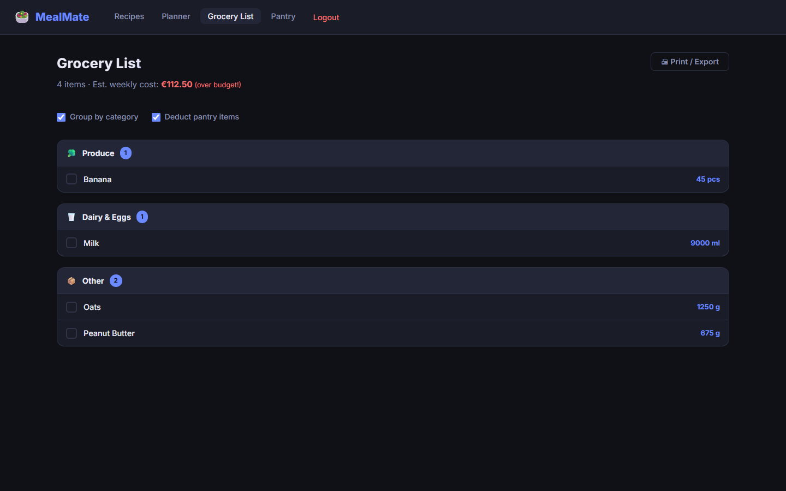
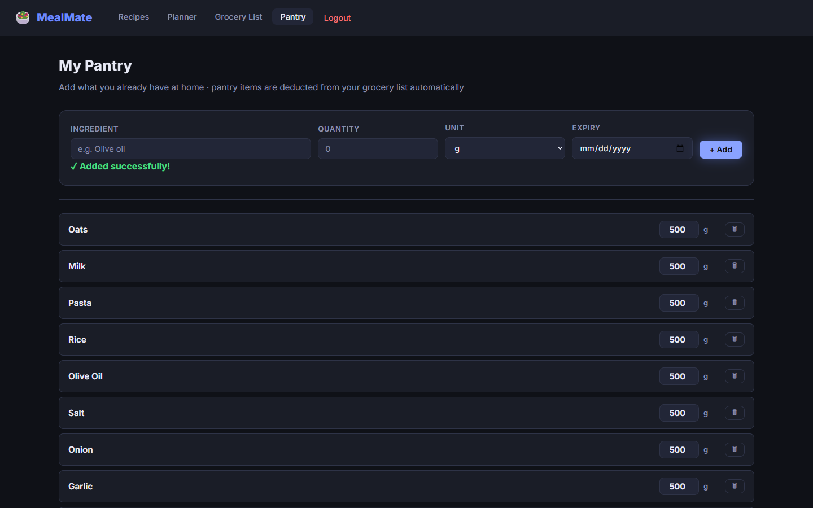
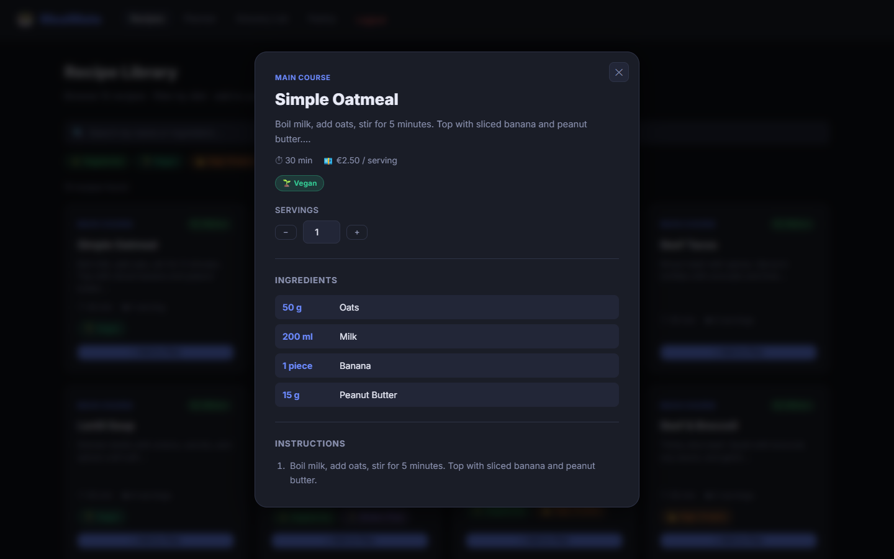
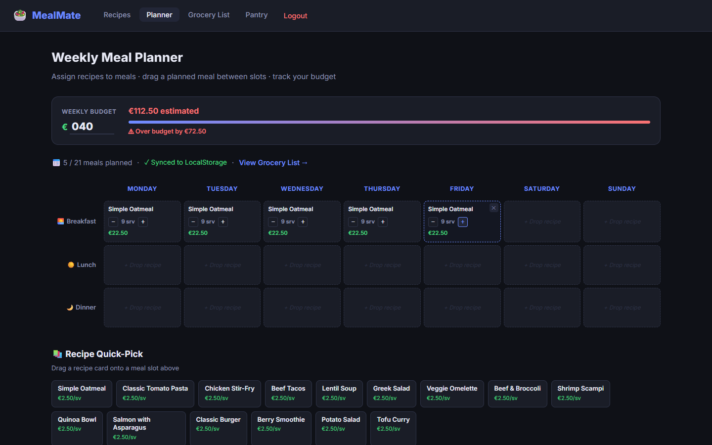
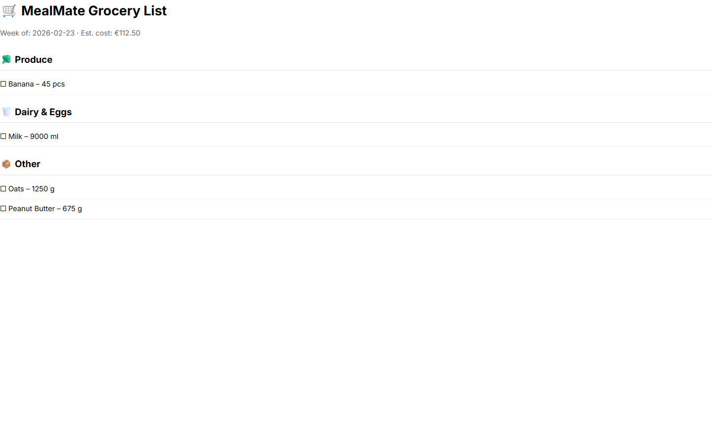

# MealMate — Application Screenshots

The following screenshots capture the MealMate application running in its final state, meeting all functional and non-functional requirements.

## 🔐 01. Login & Security
Stateless authentication gateway. Users must log in via JWT-authenticated credentials to access planning and inventory features.

## 📖 02. Recipe Library (Public)
Guests can browse and search recipes with real-time text matching and category cards.

## 🥗 03. Dietary Filtering
Dynamic filtering engine allows users to narrow down recipes by Vegetarian, Vegan, High-Protein, and Gluten-Free tags.

## 🗓️ 04. Weekly Meal Planner
Assign recipes to 21 meal slots per week. Drag-and-drop support (desktop) and per-slot serving adjustments with budget impact.

## 🛒 05. Smart Grocery List
Aggregated view of all ingredients needed for the week, with real-time budget tracking and automated pantry stock deduction.

## 🥫 06. Pantry Manager
Manage kitchen inventory with expiry date tracking and ingredient autocomplete powered by the recipe database.

## 🍽️ 07. Recipe Details
Interactive recipe viewer directly accessible from the weekly planner or library.

## ⚠️ 08. Budget Alerts
Real-time budget tracking turns red to alert users when their planned meals exceed the configured weekly budget.

## 🖨️ 09. Printable Grocery List
A clean, ink-friendly export format for taking the aggregated ingredient list to the physical store.

