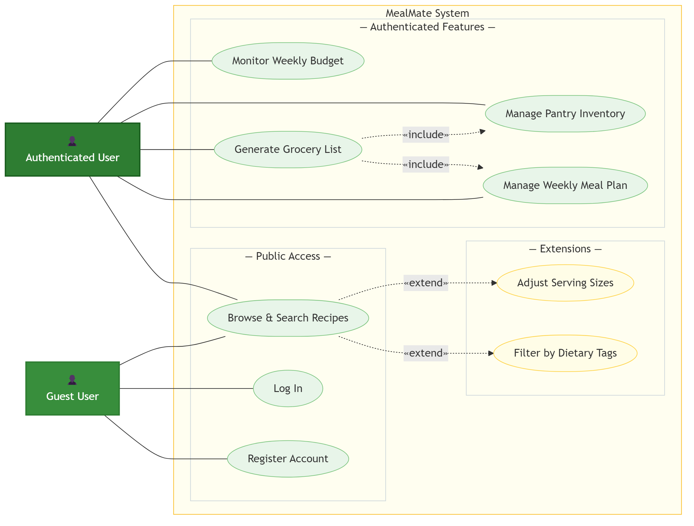
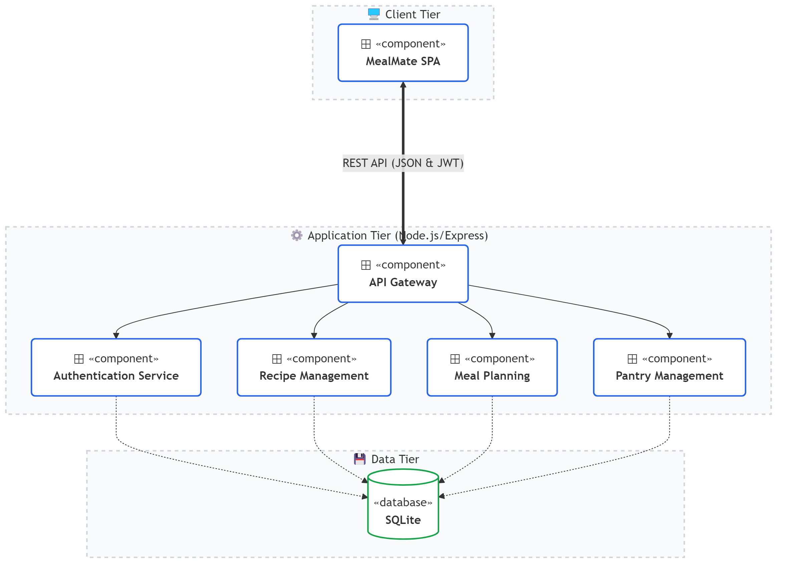
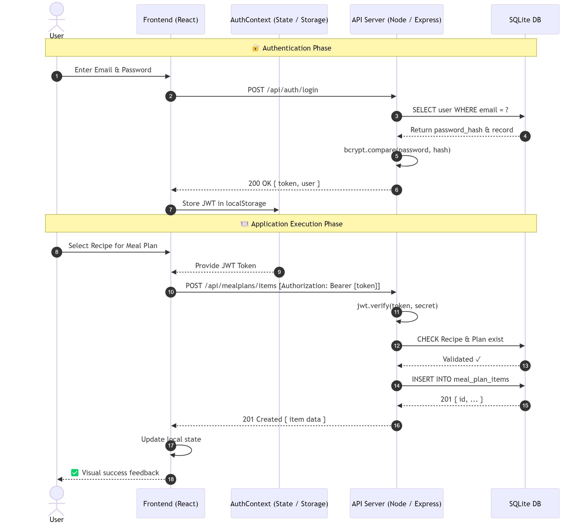
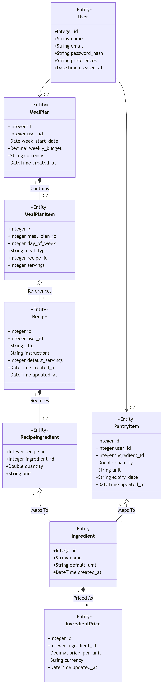

# MealMate — UML Diagrams

Visual representation of the MealMate system using standard UML notation, rendered with Mermaid.js.

---

## 1. Use Case Diagram

> 💡 The use-case model distinguishes between **Guest** and **Authenticated** users. Public access includes browsing recipes, registration, and login. Authenticated users can additionally manage meal plans, pantry inventory, grocery lists, and weekly budgets. **«include»** arrows denote mandatory sub-flows (e.g. generating a Grocery List always includes the Meal Plan and Pantry), while **«extend»** arrows denote optional behaviour (e.g. Browse Recipes can be extended with dietary filtering or serving adjustments).

---

## 2. Component Diagram

> 💡 MealMate follows a classic **Client-Server** pattern. The **React + Vite** frontend runs entirely in the browser, managing state through an `AuthContext` that persists the JWT in `localStorage`. Every protected API call attaches the token as a `Bearer` header. The **Node.js / Express** backend exposes four REST route groups (`/auth`, `/recipes`, `/mealplans`, `/pantry`), all backed by a single **SQLite** file.

---

## 3. Sequence Diagram

> 💡 The flow is split into two phases. In the **Authentication Phase** the frontend POSTs credentials, the server verifies the password hash with `bcrypt`, and returns a signed JWT that is stored in `localStorage`. In the **Application Execution Phase** the stored token is attached to subsequent requests; the server validates the signature with `jwt.verify()` before writing to the database, ensuring only authenticated users can modify meal plan data.

---

## 4. Class Diagram

> 💡 Every **User** owns zero-or-more **MealPlan** and **PantryItem** records. A `MealPlan` is composed of `MealPlanItem` rows (one per meal slot), each referencing a **Recipe**. Recipes are built from `RecipeIngredient` join records that map to shared **Ingredient** entities — keeping ingredient names canonical, and can be categorized using `RecipeTag` and `Tag` entities. Each `Ingredient` has zero-or-more **IngredientPrice** entries used for budget calculation. `PantryItem` links a user's stock to the same `Ingredient` catalogue.

