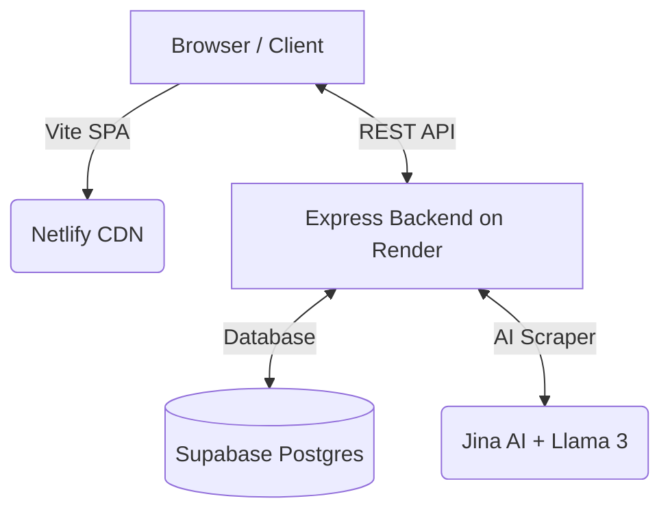

# 🥗 MealMate

MealMate is a modern, high-performance meal planning and grocery management application. Built for efficiency and a premium user experience, it helps you organize your weekly meals, optimize your budget, and manage your pantry with ease.

## 🚀 Live Demo
**[Check out the live application on Netlify](https://mealmate-app.netlify.app)**

> *Note: The backend API is hosted on Render, which may take ~50 seconds to spin up from sleep on the first request.*

> **Demo Login Credentials:**
> - **Email**: `demo@mealmate.com`
> - **Password**: `Demo1234!`

---

## ✨ Key Features

### 📖 Smart Recipe Library
- Browse a curated collection of diverse recipes.
- **Dynamic Scaling**: Adjust serving sizes, and ingredients scale automatically.
- **Dietary Filters**: Quickly find Vegetarian, Vegan, High-Protein, and Gluten-Free options.
- **Community Sharing**: Duplicate recipes directly from the Community to your personal library beautifully.

### 🤖 Intelligent AI Recipe Scraper
- **Jina AI & Llama 3.3 70B Integration**: Paste *any* recipe URL and MealMate will instantly scrape the site, extracting instructions and meticulously mapping out structured ingredients. Stop paying for bloated recipe site subscriptions. 
- **Smart Unit AI Engine**: Automatically converts unstructured recipe strings into normalized `quantity` and `unit` properties, fully aware of Metric and Imperial systems.

### 🗓️ Weekly Meal Planner
- Plan your meals for every day of the week.
- Simple, intuitive interface to assign recipes to breakfast, lunch, or dinner.
- **Persistent Backend**: Real-time serverless API with Supabase.

### 🛒 Smart Grocery List
- Automatically aggregates ingredients from your weekly plan.
- **Budget Tracking**: Real-time integration with your target budget (default: €40).
- **Pantry Deduction**: Automatically substracts items you already have.

### 🥫 Pantry Manager
- Keep track of your kitchen inventory.
- **Search Helper**: Intelligent autocomplete suggests ingredient names from the recipe library as you type, filtering out bad data.
- Seamlessly integrates with the grocery list to prevent overbuying.

### ✨ Final Polish & Interactive Enhancements
- **Global UI Dialogue Manager**: Smooth, custom-animated popups replace jarring native browser alerts perfectly executing Material motion principles.
- **Serving Memory**: The app remembers your preferred serving sizes for every recipe.

---

## Architecture
MealMate uses a decoupled SPA architecture:
- **Frontend**: React/Vite SPA hosted gracefully on Netlify.
- **Backend API**: Node.js/Express server hosted on Render.
- **Database**: Supabase (PostgreSQL) for blazing-fast, relational data persistence.



## Getting Started

### Local Development Setup
```bash
# Install dependencies
npm install

# Start Vite development server
npm run dev
```

The backend is located in the `/backend/` directory. For production deployments, connect your repository to Netlify for the frontend and Render for the backend!

---

## 🛠️ Tech Stack

- **Core**: React 18 & Vite 5
- **Styling**: Vanilla CSS (Custom Variable System)
- **Database**: Supabase (Postgres)
- **Compute**: Node.js/Express (Render)
- **AI Models**: Llama 3.3 70B (or Gemini API) & Jina AI
- **Hosting**: Netlify (Frontend) & Render (Backend)

---

## 🧪 Testing

- **Frontend Unit Tests**: `npm test` (using Vitest & JSDOM)

---

## 📄 Documentation

Comprehensive project documentation is available in the [`/docs`](docs/) folder:

- **[Project Profile](docs/PROJECT_PROFILE.md)**: Objectives, scope, and project organization.
- **[Requirements Specification](docs/REQUIREMENTS.md)**: Detailed functional and non-functional requirements.
- **[Architecture Documentation](docs/ARCHITECTURE.md)**: System design and deployment view (includes Mermaid diagrams).
- **[Traceability Matrix](docs/TRACEABILITY_MATRIX.md)**: Mapping requirements to components and tests.
- **[UML Diagrams](docs/UML_DIAGRAMS.md)**: Interactive structural logic diagrams.

---

## 📜 Credits
See [CREDITS.md](CREDITS.md) for a list of third-party libraries used.
