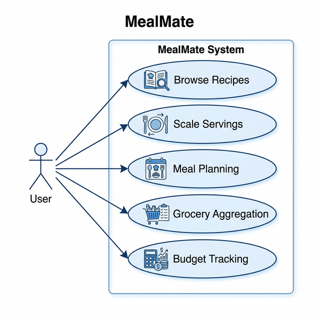
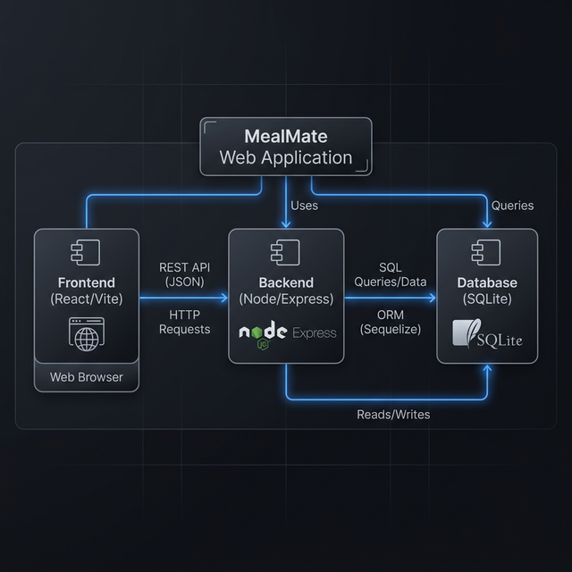
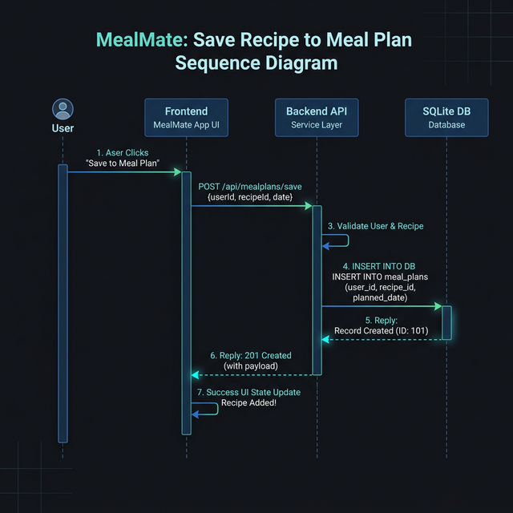
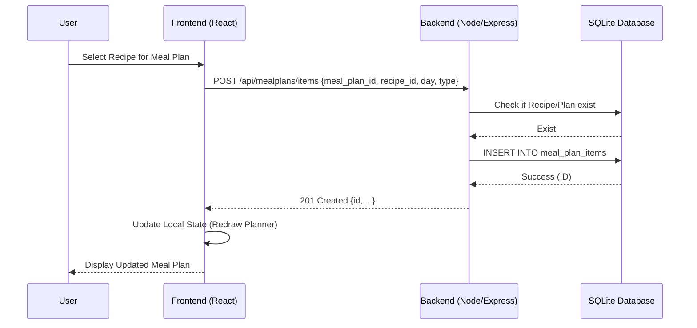

# UML Diagrams for MealMate Project

This document provides a visual representation of the MealMate system's architecture and data model using UML diagrams rendered with Mermaid.

## 1. Use Case Diagram (Functional Scope)

The Use Case diagram illustrates the core interactions between the User and the MealMate system, defining the functional boundaries of the application.



### Source (Mermaid)
useCaseDiagram
    actor User
    
    package "MealMate System" {
        usecase "Browse & Search Recipes" as UC1
        usecase "Filter by Diet Tags" as UC2
        usecase "Adjust Serving Sizes" as UC3
        usecase "Manage Weekly Meal Plan" as UC4
        usecase "Generate & Aggregated Grocery List" as UC5
        usecase "Manage Pantry Inventory" as UC6
        usecase "Monitor Weekly Budget" as UC7
    }
    
    User --> UC1
    User --> UC2
    User --> UC3
    User --> UC4
    User --> UC5
    User --> UC6
    User --> UC7
    
    UC1 ..> UC2 : <<extend>>
    UC4 ..> UC5 : <<include>>
    UC5 ..> UC6 : <<include>>
    UC4 ..> UC7 : <<include>>
```

## 2. Component Diagram (System Architecture)

The system follows a Client-Server architecture with a React-based frontend and a Node.js-based backend.



### Source (Mermaid)
```mermaid
componentDiagram
    component [Frontend (React/Vite)] as FE
    component [Backend (Node/Express API)] as BE
    database [Database (SQLite)] as DB
    
    FE -- BE : REST API (JSON)
    BE -- DB : SQL (better-sqlite3)
    
    subgraph Browser
        FE
    end
    
    subgraph Server
        BE
        DB
    end
```

## 3. Sequence Diagram (Add Recipe to Meal Plan)

This diagram illustrates the flow when a user adds a recipe to their weekly meal plan.



### Source (Mermaid)

